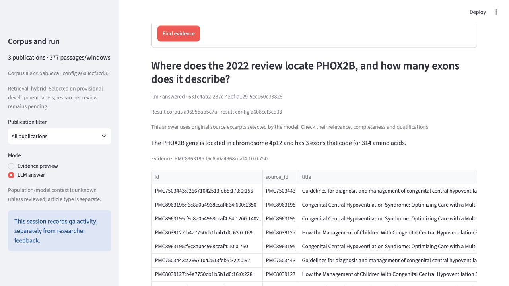
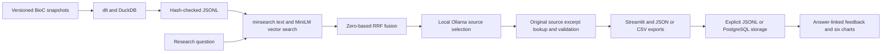
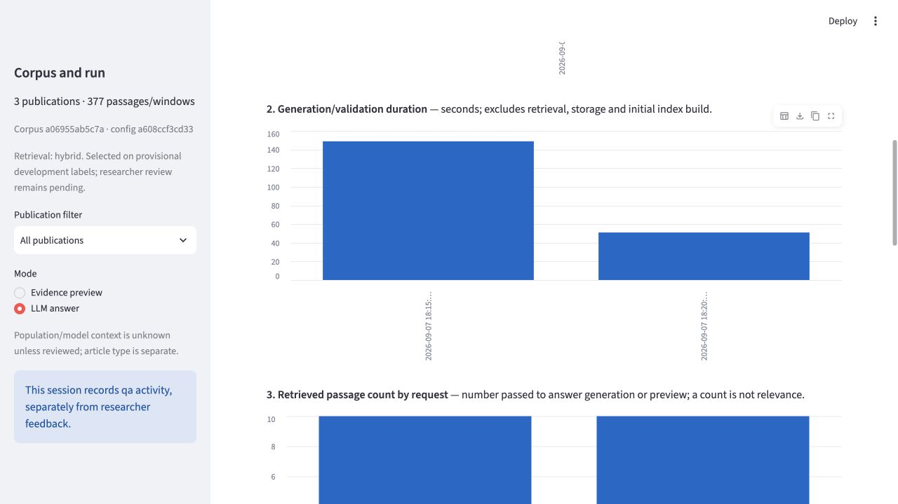

# CCHS Evidence Navigator

Find the passages behind a CCHS literature question, compare source-attributed
evidence, and export PHOX2B-related tag proposals for researcher review. The app
uses three licensed publications, local retrieval and a local language model.

I volunteer with [Yad L'Neshima (CCHS Israel)](https://cchsisrael.org/), an Israeli
association supporting research into Congenital Central Hypoventilation Syndrome,
a very rare condition. This project supports the literature-search and evidence-
organization work behind that research. Its intended benefit is less manual
searching and copying while retaining a direct path to the original text;
researcher time savings and scientific outcomes have not been measured.



**What it does.** Hybrid retrieval — `minsearch` lexical search and MiniLM vectors fused with
zero-based RRF — over three licensed CCHS publications, then a local Gemma 3 model that may only
select numbered excerpts. The application, not the model, supplies source identity, quotation text
and character offsets, so the answer cannot silently repair a number, a negation or a source ID.
Everything runs on the machine: no paid API, no inference-time download, no cloud deployment.

**How it was chosen.** A 168-search factorial over retrieval configurations, a 252-search
representation study, a title-weight ablation, and a paired prompt comparison that held the
questions and the retrieved contexts fixed and varied only the prompt. The configuration that
shipped is the one the evidence picked, and the runs that lost are still in the repository.

**Status and honest limits** are in [their own section](#limitations-authorship-and-submission),
including a quality bar this release did not meet. Nothing was removed to make the numbers better.

## The problem and useful output

A researcher needs the requested facts, publication context and material
qualifications, with an exact trace back to the source. A true quotation can still
be irrelevant or incomplete. The app therefore presents original source excerpts
selected by the model, source metadata and pending review states.

| Task | Output | Researcher action |
|---|---|---|
| Locate evidence | Ranked passages, publication link, section and exact text | Check context in the publication |
| Compare publications | Separate claim/source rows with year, article type and limitations | Decide whether observations are comparable; no agreement is inferred |
| Organize PHOX2B literature | Literal quote-term tag proposals and reasons | Approve, revise or reject; the scientific vocabulary is never changed automatically |
| Preserve work | JSON plus passage, claim-review and tag-proposal CSV exports | Trace each row to its answer, source version and configuration |

Try: **“Where does the 2022 review locate PHOX2B, and how many exons does it
describe?”** Inspect both requested facts and their exact source. The separate
absence case asks about randomized gene-editing results in the Italian study;
the expected behavior is a corpus-scoped refusal, not invented results.
These are previously exposed development questions, not blind tests.

## How it works



The model selects numbered original excerpts; the application supplies source
identity, quotations and offsets. It cannot silently repair numbers, negations
or source IDs. This preserves text fidelity, but does not establish relevance or
completeness. The [architecture](docs/architecture.md) explains each boundary.

Gemma 3 12B is an explicitly approved exception to the owner's course-model
restriction; it was not taught. The libraries and retrieval methods remain
[mapped to course evidence](docs/course-sources.md), with our adapters identified.
No paid fallback, automatic inference-time download or cloud deployment is used.

<a id="local-setup"></a>

## Run and verify

The primary route is the tested **native Mac + Ollama + explicit JSONL** path.
Prerequisites, downloads and restart steps are in [setup](docs/setup.md).
Installation and initial asset downloads are separate setup actions; they were
not repeated in the final native demonstration.

For a new machine, with setup/download authorization:

```bash
uv sync --frozen --extra vectors
uv run python -m navigator ingest
uv run python -m navigator prepare-encoder --allow-download
uv run python tools/prepare_compose_model.py --allow-download
uv run python -m navigator check-runtime
HF_HUB_OFFLINE=1 TRANSFORMERS_OFFLINE=1 ENABLE_PAID_LLM=0 TELEMETRY_BACKEND=jsonl NAVIGATOR_TRAFFIC_ORIGIN=qa uv run streamlit run app.py --server.port 8601 --server.fileWatcherType none --browser.gatherUsageStats false
```

Start the local Ollama service first. Choose **LLM answer** in the sidebar;
**Evidence preview** does not call a model. Leave `NAVIGATOR_CONFIG` and
`NAVIGATOR_REQUEST_TIMEOUT` unset to use the shipped configuration unchanged.
Use `NAVIGATOR_TRAFFIC_ORIGIN=user` only for actual user activity.

The exact configured Gemma artifact occupies about **8.15 GB**, and the pinned
MiniLM cache is about **91.6 MB** of unique files. These are artifact sizes, not
measured network transfers or total RAM requirements. A separate container model
volume needs its own copy. [Asset evidence](reports/container-runtime/asset-accounting.json)
and [native preflight](reports/final/native-preflight.json).

```bash
HF_HUB_OFFLINE=1 TRANSFORMERS_OFFLINE=1 ENABLE_PAID_LLM=0 uv run python tools/run_checks.py
```

The [current checks](reports/checks.json) include real local ingestion, retrieval
and Streamlit AppTest plus explicit synthetic provider fixtures. They do not
certify real answer quality. [Final release checks](reports/final/release-gate.json)
separate software, demonstration, source preservation and package audits.

## Data and boundaries

| Publication | Role | Reuse terms |
|---|---|---|
| PMC7503443 (2020) | European guideline | CC BY 4.0 |
| PMC8039127 (2021) | Italian retrospective study | CC BY |
| PMC8963195 (2022) | Multidisciplinary review | CC BY-NC 3.0 |

The [manifest](data/manifest.json) and [data guide](data/README.md) retain source
attribution, links and licenses; code does not relicense the papers. This
noncommercial course package is unrelated to the prohibited course FAQ corpus.
It is the owner's first intended submission, not reuse of a passed course project.

The pipeline produces **377 windows** with 750-character size and 150-character
overlap, and records **390 excluded passages**. Heading metadata is retained;
tables and figures are not searchable evidence. The current encoder check found
zero truncated inputs. [Fresh ingestion and encoder evidence](reports/final/native-setup.json).
A table-only finding is an ingestion gap, not absent scientific evidence.

The fourteen additional publications remain an [isolated local extension](docs/corpus-expansion.md).
This submission includes metadata about that work, not its additional source
files or an expanded active corpus. The extension needs its own quality work.

## Evaluation — retrieval

The bank contains 42 development and 18 final questions; 13 older questions are
regression cases. The final bank was readable and checked for integrity; it is
not described as blind. Reference labels are provisional and non-exhaustive.

On the same 42 development questions, 35 are answerable and seven are absence
cases. The latter are not counted as Hit/MRR opportunities.

| Actual configuration | Full annotated reference coverage | Mean reference coverage | Hit at k | MRR at k |
|---|---:|---:|---:|---:|
| Vector / 5 | 18/35 | 0.5667 | 0.6000 | 0.4695 |
| Vector / 10 | 20/35 | 0.6667 | 0.7429 | 0.4906 |
| Hybrid / 5 / title2 / RRF50 | 15/35 | 0.4952 | 0.5714 | 0.3452 |
| Hybrid / 10 / title2 / RRF50 | 21/35 | 0.6429 | 0.6857 | 0.3617 |

[Factorial evidence](reports/release-quality/retrieval-factorial.json) retains
168 searches. A separate title-weight ablation and
[fresh hybrid/top-10/title-0 run](reports/release-quality/hybrid-zero-fresh.json)
fully covers annotated references in **26/35**, with mean fractional coverage
**0.7762**, across 42 searches. That retrieval configuration is now used.

The [252-search representation study](reports/release-quality/representation-results.json)
retains gains and losses. Content-only encoding loses some identifier/comparison
evidence. LIM-01's required caveat remains outside both candidate pools; COM-02
and PAR-02 also have documented misses. PAR-01 illustrates incomplete reference
annotation. Labels were not edited to improve metrics. [Failure analysis](docs/release-status.md#retrieval-comparison-and-failure-diagnosis).

## Evaluation — generated output

The controlled source-excerpt pair used the **same 12 questions and retrieved
contexts**, varying only the prompt: concise yielded **6/12**, complete **8/12**
fully acceptable answers. Both had zero malformed outputs and one critical
wrong-context answer. Complete was selected as the submission candidate, with
the failed internal bar explicitly retained. [Paired records and rationale](reports/final/selection-2026-09-07.json).

The following is a **historical experiment inventory**, not one uniform
18-candidate competition. Different phases use different questions, contexts and
runtime versions; five-case feasibility and reference-context diagnostics cannot
replace the twelve-case pilot.

| Experiment and context | Arm | Fully acceptable | Output errors | Critical answers |
|---|---|---:|---:|---:|
| Initial pilot; vector/5 | Phi3 / evidence_first | 0/12 | 6 | 2 |
| Initial pilot; vector/5 | Phi3 / numbered_evidence | 2/12 | 9 | 0 |
| Initial pilot; vector/5 | Gemma3 / evidence_first | 3/12 | 1 | 2 |
| Initial pilot; vector/5 | Gemma3 / numbered_evidence | 4/12 | 1 | 2 |
| Format diagnostic; hybrid/10/title0 | Gemma3 / object mode | 1/2 | 1 | 0 |
| Format diagnostic; hybrid/10/title0 | Gemma3 / schema mode | 1/2 | 1 | 0 |
| Precision repair; hybrid/10/title0 | Gemma3 / numbered_evidence | 4/12 | 4 | 1 |
| Precision repair; hybrid/10/title0 | Gemma3 / numbered_precise | 4/12 | 4 | 0 |
| Source-span feasibility, five cases | Gemma3 / source_spans_complete | 3/5 | 0 | 1 |
| Source-span concise diagnostic, same cases | Gemma3 / source_spans_concise | 2/5 | 2 | 0 |
| Source-excerpt feasibility, same cases | Gemma3 / source_extract_concise | 3/5 | 0 | 0 |
| Source-excerpt feasibility, same cases | Gemma3 / source_extract_complete | 4/5 | 0 | 0 |
| Source-excerpt six-slice pilot | Gemma3 / source_extract_concise | 6/12 | 0 | 1 |
| Source-excerpt six-slice pilot | Gemma3 / source_extract_complete | 8/12 | 0 | 1 |
| Checked selection feasibility, five cases | Gemma3 / source_extract_checked | 3/5 | 0 | 1 |
| Reasoned selection feasibility, same cases | Gemma3 / source_extract_reasoned | 3/5 | 0 | 1 |
| Phi3 source-selection feasibility, same cases | Phi3 / source_extract_checked | 1/5 | 3 | 1 |
| Phi3 source-selection feasibility, same cases | Phi3 / source_extract_reasoned | 2/5 | 0 | 2 |

[Full ledger and source-based reviews](docs/release-status.md#generation-ledger-and-source-based-reviews)
link the original results, review summaries and rejected alternatives. Structure,
quote fidelity, semantic support, fact completeness, qualifications and correct
abstention are assessed separately. All visible/exported prose is reviewed.
Partial fact counts diagnose failures; they do not replace the pass rule.

The complete prompt's twelve-case pilot observed **53.5 seconds mean and 63.6
seconds maximum** for generation/validation. These are observations in that
specific native pilot, not latency promises. The new two-case operational flow
observed 148.8 seconds for EXA-01 and 51.0 seconds for ABS-01 generation/validation,
with total pre-storage request times of 155.2 and 51.8 seconds.
[Separate native observations](reports/final/native-bound-flow.json).

## Best practices and decisions

- **Hybrid search:** lexical and vector branches are evaluated and fused; the
  measured top-10/title-0 configuration is active.
- **Reranking:** manual zero-based RRF uses `1 / (50 + rank0)`, retaining both
  branch ranks and final order. This is the course's demonstrated fusion route;
  separate credit for the same hybrid operation is up to the reviewer.
- **Rewriting:** implemented with one bounded local call, identifier guards and
  original-query fallback. It remains **disabled**. In the declared diagnostic,
  all twelve local calls returned the original question unchanged, with identical
  search ranks: no gains and no losses. Both routes had Hit@10 **8/10** and
  MRR@10 **0.2876** on ten answerable questions; two absence questions were excluded
  from these retrieval metrics. Rewriting added 6.3 seconds mean and 18.7 seconds
  maximum per query in this run, with no observed benefit. These are retrieval
  results, separate from the 8/12 answer-quality pilot.
  [Raw calls and ranks](reports/final/rewrite-diagnostic.json),
  [intent review and decision](reports/final/rewrite-diagnostic-review.json).

[Seventeen decision cards](docs/decisions.md) connect requirements, alternatives,
trade-offs, verification and revisit conditions. [D37](docs/release-decisions.md#d37--submission-candidate-with-an-explicit-quality-exception)
records why this candidate is used without relabeling a failed quality result.

## Interface, exports and monitoring

The [new browser record](reports/final/native-bound-flow.json) captures real
downloaded bytes, matching stored answer IDs, source spans, linked QA feedback
and records retained after stopping and restarting the native app. Research tag
proposals remain `PROPOSED_PENDING_HUMAN_REVIEW` in downloads.



| Chart | Source and denominator |
|---|---|
| Daily requests | Stored requests in selected origin/mode, including failures; UTC days |
| Generation/validation duration | Recorded seconds per request; excludes retrieval, storage and index build |
| Retrieved passage count | Context rows per request; count is not relevance |
| Feedback distribution | Unique rated answers in the selected scope; coverage shown against stored requests |
| Request outcomes | Final statuses of all scoped stored requests, including errors |
| Provider tokens | Observed input/output usage by model; missing usage stays unknown |

QA traffic and assistant feedback demonstrate functionality; they are not
researcher satisfaction. Local calls have zero API billing, with electricity and
compute costs unmeasured. [Monitoring code](navigator/monitoring.py).

## Containers and reproducibility

[Compose](compose.yaml) defines pinned Python, Ollama and PostgreSQL images,
locked Python dependencies, ingestion, encoder/model setup and persistent volumes.
Follow the complete [setup/restart instructions](docs/setup.md#full-compose-route--execution-pending)
before using the download-capable Compose setup. The native path is the primary
demonstrated route for the bound Gemma configuration.

The **historical Phi3** [Compose rehearsal](reports/container-rehearsal.json)
proved build, initialization, 172 Linux checks, a valid abstention, browser
downloads, feedback and PostgreSQL restart persistence. Its two answerable calls
timed out at 120 seconds. **Gemma 3 12B was not rehearsed in Compose**; changing
the app config does not make that historical execution evidence apply to Gemma.
No container weights were copied or resources changed for this release.

## Rubric-to-evidence route

The [official rubric](https://github.com/DataTalksClub/llm-zoomcamp/blob/main/project.md#evaluation-criteria)
controls grading. These are evidence links and limits, not awarded points.

| Criterion | Maximum | Implementation, result and reproduction evidence | Limit |
|---|---:|---|---|
| Problem | 2 | [Use cases](#the-problem-and-useful-output), [source manifest](data/manifest.json) | Researcher benefit is intended, not measured |
| Retrieval with LLM | 2 | [RAG](navigator/rag.py), [native flow](reports/final/native-bound-flow.json), [setup](docs/setup.md) | Two operational cases do not establish general quality |
| Retrieval evaluation | 2 | [Factorial](reports/release-quality/retrieval-factorial.json), [active choice](reports/final/selection-2026-09-07.json) | Provisional, incomplete reference labels; losses retained |
| Answer evaluation | 2 | [Paired source-extract review](reports/final/selection-2026-09-07.json), [active config](configs/app.json) | 8/12 and one critical failure; internal bar not met |
| Interface | 2 | [Streamlit](app.py), [actual downloads](reports/final/native-bound-flow.json), [walkthrough](docs/setup.md) | Native route demonstrated |
| Ingestion | 2 | [dlt pipeline](navigator/corpus.py), [fresh counts](reports/final/native-setup.json), [ingest command](docs/setup.md) | Tables/figures excluded |
| Feedback and monitoring | 2 | [Storage](navigator/storage.py), [six charts](#interface-exports-and-monitoring), [flow](reports/final/native-bound-flow.json) | QA feedback is not researcher satisfaction |
| Containers | 2 | [Compose](compose.yaml), [historical execution](reports/container-rehearsal.json), [setup](docs/setup.md#full-compose-route--execution-pending) | Historical Phi3; bound Gemma execution unproved |
| Reproducibility | 2 | [Setup/restart](docs/setup.md), [locks](uv.lock), [source data](data/README.md), [release gate](reports/final/release-gate.json) | Existing-assets native proof; public-clone receipt follows commit |
| Hybrid retrieval | 1 | [Both branches and fusion](navigator/retrieval.py), [ablation](reports/release-quality/retrieval-factorial.json) | Improvement is task-specific |
| Reranking | 1 | [Zero-based RRF](navigator/retrieval.py), [rank diagnosis](reports/release-quality/full-rank-miss-diagnostic.json), [course mapping](docs/course-sources.md) | Possible overlap with hybrid credit |
| Query rewriting | 1 | [Bounded implementation](navigator/rewriting.py), [diagnostic status](#best-practices-and-decisions) | Disabled; no automatic bonus claim |
| Cloud | 2 | [Deployment scope](reports/final/compose-final.json) | No cloud deployment; no points claimed |
| Discretionary additions | Up to 3 | [Traceable research exports](navigator/exports.py), [browser evidence](reports/final/native-bound-flow.json) | Examiner judgment; no guaranteed award |

## Limitations, authorship and submission

> **Submission candidate — 7 September 2026.** The app binds
> `gemma3:12b` / `source_extract_complete` / hybrid top-10, title boost 0,
> zero-based RRF k=50. In the paired development pilot, **8/12 answers were fully
> acceptable, with one critical relevance failure (LIM-01)**. The internal
> zero-critical quality bar was **not met**; the owner accepted submission with
> this disclosure. The final 18-question inference test was **not run**.
> Judgments are provisional assistant reviews, not independent scientific review.
> [Decision and exact identities](reports/final/selection-2026-09-07.json).

The new demonstration checks the actual configured app, not a replacement quality
sample: one EXA-01 attempt and one ABS-01 attempt, with exports, feedback and native
restart persistence. [Recorded outcomes](reports/final/native-bound-flow.json).
The historical pilot failure remains visible and unchanged.

The candidate has a known critical relevance error and incomplete answers;
exact quotations are not a correctness certificate. Three papers and excluded
tables limit coverage. The final 18-question inference test and full 42-question
paired generation follow-up were not run. The new two-case demo does not estimate
accuracy. No independent researcher assessment or scientific validation is claimed.

Codex assisted implementation, testing, experiments, documentation and provisional
source-based review. Claude's critique informed explicit decisions. Approximate
quote repair, arbitrary weighted pass scores and hidden removal of failed runs
were rejected. The owner accepted a disclosed submission-policy exception, while
the quality evaluator and its failed judgments remain unchanged. Course
adaptations are attributed. The owner is responsible for understanding the work.

The public release is for course review; it is not clinical advice, an exhaustive
review or a scientific discovery system. Article licenses and attribution remain
controlling. No cloud bonus or guaranteed bonus double credit is claimed.

The owner saves the course form and completes peer reviews personally. Use the
actual full commit SHA and exact public tree; a tag or public URL alone is not
a saved submission. [Submission checklist](docs/readiness.md) ·
[50-check audit](docs/pre-submission-audit.md) ·
[Agent continuation prompt](docs/IMPLEMENTATION_PROMPT.en.md).
